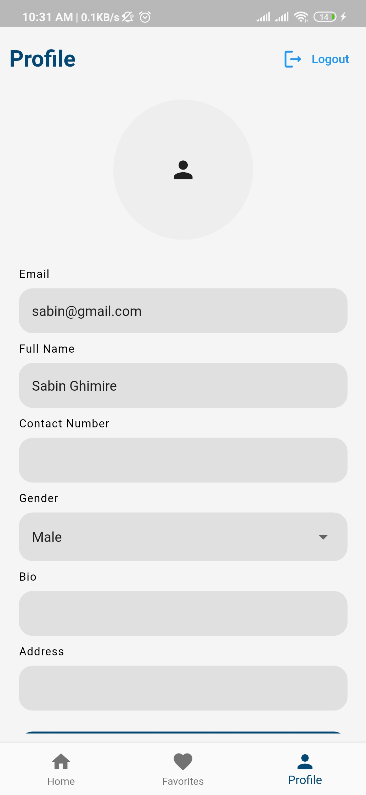

# NewsConnect Flutter App

NewsConnect is a Flutter application demonstrating proficiency in user management, API integration, state management using the BLoC pattern, and optionally, clean architecture principles.

## Features

1. **User Management**
   - User Registration: Sign up with email, password, name, and age.
   - User Login: Access the app securely.
   - User Profile: View and update user details.
   - Authentication via Firebase.

2. **News API Integration**
   - Fetch and display news articles from NewsAPI.
   - View news details and mark articles as favorites.

3. **Search Functionality with Debouncing**
   - Search news articles by keywords.
   - Debouncing to limit API calls while typing.

4. **State Management (BLoC Pattern)**
   - Organized management for authentication, news, profile, favorites, and search.

5. **Bottom Navigation Bar**
   - Navigate between Home (news list and search), Favorites, and Profile screens.

6. **Offline Data Handling**
   - Cache news articles locally using SQLite.
   - Display cached data when offline.

7. **App Icon**
   - Custom-designed app icon.

## Project Screenshots

| Screen Name           | Screenshot                                              |
|-----------------------|---------------------------------------------------------|
| **Login Screen**       |            |
| **Registration Screen**|  |
| **Home Screen**        |              |
| **News Details Screen**|  |
| **Favorites Screen**   |    |
| **Profile Screen**     |        |

## Contact

Feel free to ask if there is anything regarding the project.  
[Email](work.sabinghimire@gmail.com) : `work.sabinghimire@gmail.com`

## APK

[Download APK](https://github.com/Saw2110/NewsConnect/raw/main/appfile/NewsConnect.apk)
